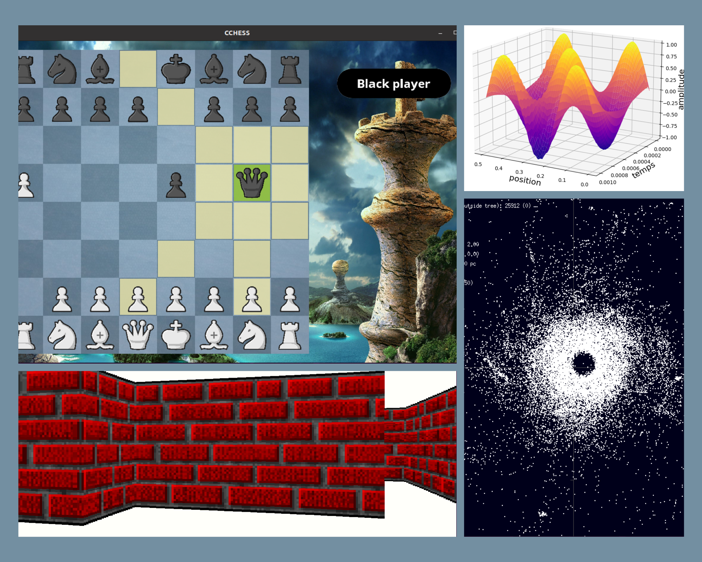
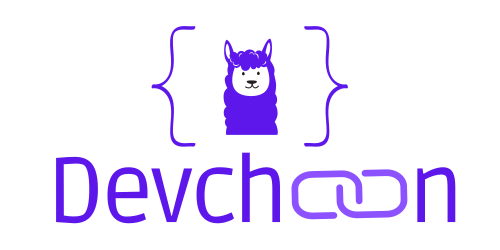
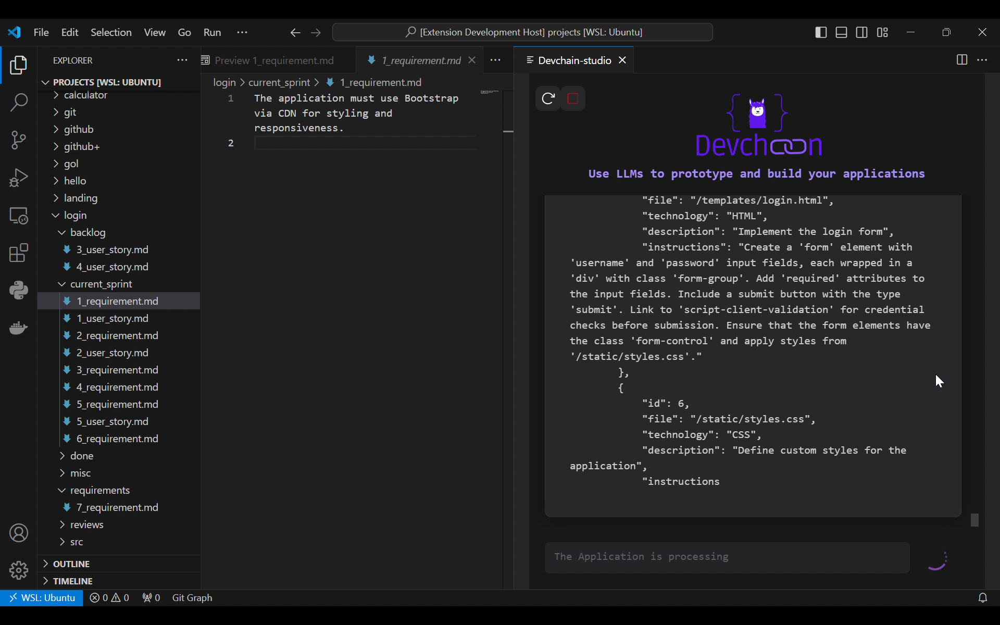

<h1 align="center">Hi 👋, I'm Rudio</h1>
<h3 align="center">An engineering student in Applied Mathematics and Computer Science.</h3>
<h3 align="center">🚀Seeking to be an AI Software Engineer.</h3>

## ⚡ Technologies
Talk to me about:
- Programming in **Python, C, C++, R**.
- Machine Learning and Deep Learning with **Scikit-learn**, **Pytorch** and **Keras**.
- Software engineering in Python with **FastAPI** and **Flask**.
- LLM engineering with **Langchain**.
- High Performance Computing in **C/C++**.
- Data analysis/science in **R** and **Python**.
- Robotic programming with **ROS2**.
- Numerical simulations in **C/C++**, **Python**.

<h3 align="left">Connect with me:</h3>

<h3 align="left">Languages and Tools:</h3>

          🦜⛓️ 

&nbsp;

## 🔭 Projects Overview

### Academic and personal project

### Devchain/Devchain-studio (End-of-studies intership project)

DevChain is an AI powered application that helps you build software by providing code. It relies on a multi-agent system to simulate the developpment life cycle, following more or less the Scrumban methodology. It is built on top of the Langchain framework. Each agent of the system will be powered and simulated by a Large Language Model (LLM).

<!--
**Rudiio/Rudiio** is a ✨ _special_ ✨ repository because its `README.md` (this file) appears on your GitHub profile.

Here are some ideas to get you started:

- 🔭 I’m currently working on ...
- 🌱 I’m currently learning ...
- 👯 I’m looking to collaborate on ...
- 🤔 I’m looking for help with ...
- 💬 Ask me about ...
- 📫 How to reach me: ...
- 😄 Pronouns: ...
- ⚡ Fun fact: ...
-->
